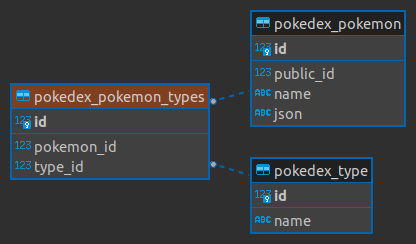

# Poke-api

## Setup

1. Install your python environment:

    ```python3 -m venv .venv```

2. Source your env:

    ```source .venv/bin/activate```

3. Setup env variables:

    ```cp .env.example .env```

4. Migrate the database:

    ```python manage.py migrate```

5. Populate/update the pokedex cache:

    ```python manage update_pokedex```

6. Run the development server:

    ```python manage.py runserver_plus 0.0.0.0:8080```

## Database


